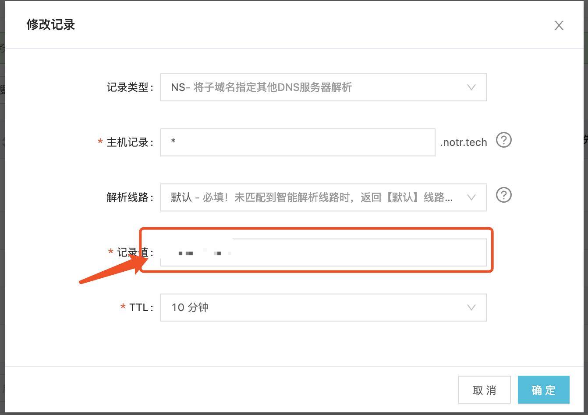

## ddns/notrns
一个动态域名解析的项目，允许外部应用调用api来添加域名解析，域名存储在嵌入式数据库中。不涉及太多DNS协议的知识，所以不用特别纠结在协议层面。

## 项目起源
项目原本属于[notr](http://www.notr.tech)中的其中一个功能模块，由于其相对比较独立，所以将做了一些调整并开源出来

## 使用示例

**下载运行**
```
go get gitub.com/ICKelin/notrns
cd $GOPATH/ICKelin/notrns/main
go build -o notrns

./notrns -c ../etc/ddns.conf
```

**测试**
```
api做了简单的验证，默认的token是SUNLZWxpbkBub3RyLnRlY2g=
curl localhost:5843/api/v1/build_in_domain/add -d '{"domain":"ICKelin.com", "IP":"120.25.214.69"}' -H "access-token:SUNLZWxpbkBub3RyLnRlY2g=" -v

➜ nslookup abc.com 127.0.0.1       
Server:         127.0.0.1
Address:        127.0.0.1#53

Non-authoritative answer:
Name:   ICKelin.com
Address: 120.25.214.69
```

## tips
可以配合NS记录一起使用，配置好域名的ns记录指向ddns部署的ip地址。以阿里云为例



## 致谢

[bolt db](github.com/boltdb/bolt)
[miekg dns](github.com/miekg/dns)
